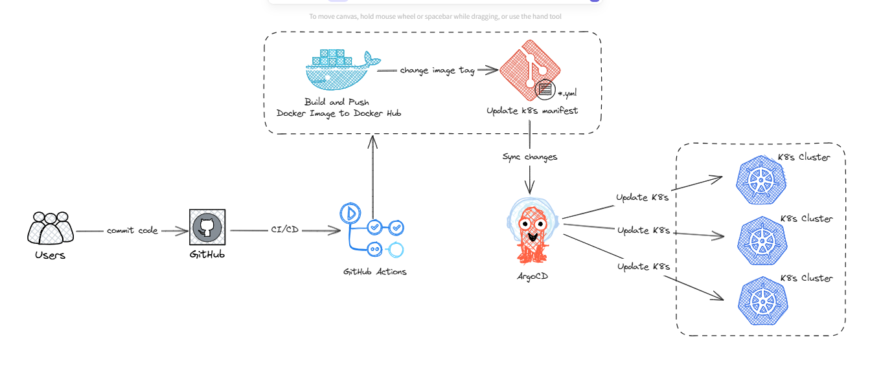
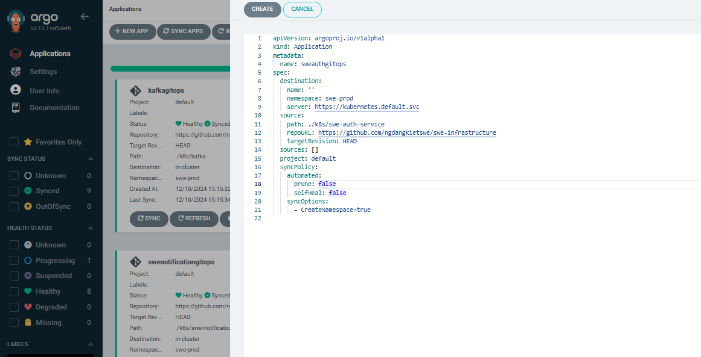
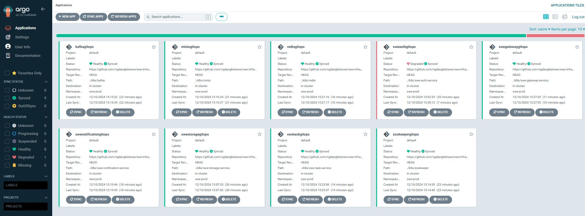

# SWE-INFRASTRUCTURE

This is a simple infrastructure project that uses Kubernetes(K8s) for container orchestration. ArgoCD is used for
continuous deployment.

## Tech stack

- [x] [Docker](https://www.docker.com/)
- [x] [Kubernetes](https://kubernetes.io/)
- [x] [ArgoCD](https://argoproj.github.io/argo-cd/)

## Diagram



## How to run

1. Install [minikube](https://minikube.sigs.k8s.io/docs/start/)
2. Start minikube

    ```bash
    minikube start
    ```

3. Apply the k8s configuration

    ```bash
    make apply-all
    ```
4. Check the pods

    ```bash
    kubectl get pods -n swe-prod
    ```
5. Check the services

    ```bash
    kubectl get svc -n swe-prod
    ```
6. Check the deployments

    ```bash
    kubectl get deploy -n swe-prod
    ```
7. Updating...

## ArgoCD

- To install ArgoCD on an NKE (or any other Kubernetes cluster), you can use the following command:
  
  ```bash
  make apply-argocd
  ```
- After running the installation command, you can verify the deployment by checking the status of the ArgoCD pods:
  
   ```bash
   kubectl get pods -n argocd
   ```
- To access the ArgoCD UI, you can use the following command:
  
   ```bash
   kubectl port-forward svc/argocd-server -n argocd 8080:443
   ```
- You can now access the ArgoCD UI by visiting `http://localhost:8080` in your browser. The default username is `admin`
  and the password is the name of the ArgoCD server pod. You can get the password by running the following command:
  
   ```bash
   kubectl -n argocd get secret argocd-initial-admin-secret -o jsonpath="{.data.password}" | base64 -d
   ```
- Next, we have to create an App in ArgoCD in which we basically define where is our application’s repository located
  and where to deploy it, and some other small configurations:
  
  
- After creating the app, you can sync it by clicking on the `SYNC` button. This will deploy the application to the
  Kubernetes cluster.
- Result:
  
  
